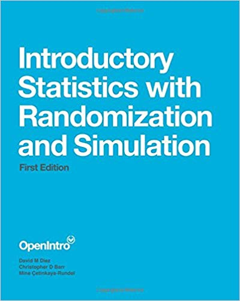

# Overview

**Professor:** Joe Roith

**Office:** 403 Regents Hall of Mathematical Sciences (RMS)

**Telephone:** (507) 786-3140

**Email:** [roith1@stolaf.edu](mailto:roith1@stolaf.edu) 

**Drop-in office hours:** Tue 10 - 11 AM, Wed 2 - 3 PM, Thurs 9 - 10 AM. 

You may also schedule an appointment with me (check my [calendar](https://calendar.google.com/calendar/r/week/2019/9/11?tab=mc&pli=1) for availability) or drop by and talk if my door is open.

**Class meetings:**	MWF 12:55 - 1:50pm RNS 160R

**Course computing:** R and [RStudio](https://r.stolaf.edu/s/04ca1cfc78a312bd79b08/auth-sign-in?appUri=%2F)

**Textbook:** *Introductory Statistics with Randomization and Simulation (2014)*,
David M. Diez, Christopher D. Barr, Mine Çetinkaya-Rundel

> Available free online or from Amazon or the bookstore for under $10
**Companion website:**	[https://www.openintro.org/stat/textbook.php](https://www.openintro.org/stat/textbook.php)

**Link to the "real" syllabus:** [Shadow Syllabus for *all* your classes](https://sonyahuber.com/2014/08/20/shadow-syllabus/amp/)

# Course description

Statistics is the science of learning from data. By now you are aware that vast amounts of data are collected every moment in a variety of settings like political polls, clinical trials, stock markets, and social media user metrics to name just a few. Statistical methods are especially critical to the sciences, as they are our only real way to test theories, quantify natural phenomenon, create accurate predictions, and make evidence-based decisions.

Some of the practical ways in which statistics is used in the sciences include:

* Medicine (monitoring patient information and history for more accurate diagnosis and prognosis)

* Biostatistics (designing and analyzing clinical trials and epidemiological studies)

* Bioinformatics (studying DNA data and human genetics as related to disease)

* Actuary (performing analysis in the insurance and superannuation industry)

* Ecology (environmental monitoring, species management, land surveying)

* Climatology (weather forecasting using historical data)

* Demography (studying the dynamics of human populations)

* Psychometrics (constructing instruments for educational or psychological measurement)

* Image processing (aiding in computer vision, facial detection, and remote sensing)

Statistics is a unique field of study as it lends itself equally to any of the areas mentioned above, but is built on its own theories and rules. We constantly evolve approaches to data collection, analysis, and interpretation. Although we use mathematics, statistics is quite different. Be prepared to *think* and *read* critically in this class. In addition, there is a language and vocabulary of statistics that is important to use properly.

# Course objectives

1. To learn ways of investigating questions involving statistical concepts.

2. To develop basic skills in three key areas of statistics:

    * data collection – methods for obtaining meaningful data

    * data analysis – methods for exploring, organizing, describing, and modeling data

    * statistical inference – making decisions with data

3. To develop an understanding of statistical concepts and an ability to interpret the results of statistical analyses and to communicate those results using clear and precise statistical language.

4. To receive an exposure to statistical problems from a wide variety of sources (medical studies, newspaper surveys, sociology studies, etc.) and encompassing a variety of data types and collection methodologies.

5. To obtain practical experience in study planning, data collection, and the written communication of statistical concepts through individual homework assignments and group projects.

# Features of this course

## Philosophy
This course and this textbook are centered on the idea that you will better understand and retain important statistical concepts if you build your own knowledge and practice using it, rather than by memorizing and regurgitating a set of facts. In order to actively construct knowledge in statistics, you must:

* engage in the material and think carefully about it; there are rarely rote, black and white solutions in statistics.

* Attend class, participate in class, and complete pre-class preparations.

* Become skillful at using R, a software package for exploring, modeling, and making decisions with data. You’ll have opportunities to use R inside and outside of class.

* Expect small amounts of daily homework, decent-sized weekly homework sets, and longer projects which allow you to pull your knowledge together.

## Computing
This course will use R extensively. Begin by reading the guides to R posted on the Moodle page. These provide an introduction to R, the software used for this course, and RStudio, a wrapper for R. Course datasets and code are easily available on the R server which can be accessed by the link on Moodle. Further instructions will be provided in class.

Learning R is necessary to do statistics. There is a learning curve, but try not to get too frustrated. Come to office hours, attend SI sessions, ask friends for help, post to our computing issues thread, and ask me questions in class. Past students have found learning R to be ultimately very useful and even fun. R is freely downloadable for both Mac and PC at [https://cran.r-project.org/](https://cran.r-project.org/), and it’s available on a St. Olaf server!

Our classroom (RNS 160R) is not equipped with computers, so please bring your own device. There are several laptops in the classroom that may be used by request. I will tend to use the PC side in class. COMPUTERS ARE TO BE USED FOR EDUCATIONAL PURPOSES ONLY! Students who use computers during class time for purposes beyond Stat 212 (email, internet surfing, paper writing, etc.) may have their computer privileges revoked and participation points reduced.

## Grades
Your course grade will be determined as follows:

Grade Subgroup        |  Weight
--------------------- | ---------
Homework Assignments |		20%
Midterm Exams (2)	|		20% each
Group Project		|		20%
Final Exam			|	    20%

College wide grading benchmarks can be found at: [http://catalog.stolaf.edu/academic-regulations-procedures/grades/](http://catalog.stolaf.edu/academic-regulations-procedures/grades/)

## Homework
Homework assignments will be assigned weekly. Homework assignments are designed to give you practice applying new statistical concepts to new data contexts. Homework will be drawn from the exercises at the end of each chapter as well as additional questions. The homework assignments are long, so you should work through them as we go along. Some of the problems require computation. Code snippets in these cases will usually be provided.

* You are encouraged to discuss problems together, but each person must hand in their own work.

* You must show your work for full credit. Homework will be graded in large part for completeness, with some specific answers spot checked.

* Homework is due by 11:55 PM on the due date (generally Thursday). Anything after this will be assessed a late penalty. This includes late assignments due to technical issues. Plan ahead.

* I expect that you will start soon after receiving the assignment. The assignments are definitely not designed to be one-night jobs.

* Homework is completed using RMarkdown and you are required to upload both the RMarkdown (.Rmd) file and knitted pdf file to Moodle.

* There will be 1-2 "Independent Homework" assignments in which you must sign an Honor Code pledge that you worked alone. This is to encourage everyone to develop their own skillset for analyzing data with R.

## Class Preparation and Participation
You are expected to come to class having read the assigned readings and completed assigned work. You will be asked to show work on the board, work with classmates on in-class activities, and engage in classroom assignments. Course grades may be adjusted based on class participation and attendance.

## Classroom behavior
I am happy to take any questions in class, no matter how trivial they may seem. To facilitate an open learning environment, please respect each other. Raise your hand, listen when others are talking (including me), and avoid distracting or rude behavior. Please turn off your cell phone ringers, and
refrain from using your phone during class.

## Exams
The midterm and final exams will focus on your abilities to use the statistical software, to interpret results, to express an understanding of statistical concepts, and to engage in statistical thinking on open-ended questions. They will *not* focus on plug-and-chug mathematics or hairy mathematical proofs. Make-up exams will be granted only under *very* special circumstances, and *only* if arranged in advance.

## Project
A group project will be completed by the end of the semester. These are *team*-oriented tasks that will require more extensive writing, data analysis, and critical thinking than a typical homework assignment. The project will involve both a verbal presentation at the midway point and a written report at the end. *No* projects will be accepted after the due date.

# Available help 

You can all be successful in this class! If you are struggling or if you’re feeling good about things but have some questions, there are several resources:

Come see me at my drop-in office hours, or make an appointment, or see if my door’s open

* Connect with your classmates.

* CIR Office Hours are 1-2 PM Mon-Fri and 7:30-8:30 PM Sun-Thurs for project questions only.

* Visit the [Academic Support Center](https://wp.stolaf.edu/academic-support/) if you want to improve your general study skills and habits.

## Supplemental Instruction
This section of Stat 212 is supported by Supplemental Instruction (SI). SI is a series of weekly review sessions for students lead by the SI Leader Noah Hillman. SI is provided for all students in the course who want to acquire effective learning strategies, develop a stronger understanding of course material, and improve their grades. In most cases, regular SI attendance results in at least one letter grade higher than if a student never attended. SI is a structured and collaborative learning environment where students can further engage with course material and enhance their learning. SI sessions will start the first week of class and end the last day of classes. Faculty support and SI are the primary resources for students enrolled in this class.

### Noah’s SI sessions –

## Tutor Requests 
Tutors are available through the [CAAS](https://wp.stolaf.edu/caas). I will only approve a tutor request once you have taken full advantage of resources available to you in and out of class. You are encouraged to work with classmates on homework and form study groups. You are required to attend SI sessions and office hours prior to requesting a tutor. Additionally, you must discuss with me your goals for working with a tutor prior to placing a request with ASC. Absence from class will prevent you from obtaining or continuing with an assigned tutor.

# Notes and Statements

## Note about Disabilities 

I am committed to supporting the learning of all students in my class. If you have already registered with Disability and Access (DAC) and have your letter of accommodations, please meet with me as soon as possible to discuss, plan, and implement your accommodations in the course. If you have or think you have a disability (learning, sensory, physical, chronic health, mental health or attentional), please contact Disability and Access staff at 507-786-3288 or by visiting [wp.stolaf.edu/academic-support/dac](wp.stolaf.edu/academic-support/dac).

## Statement of Inclusivity 

In keeping with St. Olaf College’s mission statement, this class strives to be an inclusive learning community, respecting those of differing backgrounds and beliefs. As a community, we aim to be respectful to all citizens in this class, regardless of race, ethnicity, religion, gender or sexual Orientation.

I am committed to making course content accessible to all students.  If English is not your first language and this causes you concern about the course, please speak with me.

## Note about Academic Integrity

Plagiarism, the unacknowledged appropriation of another person’s words or ideas, is a serious academic offense. It is imperative that you hand in work that is your own, and that cites or gives credit to others whenever you draw from their work. Please see St. Olaf’s statements on academic integrity and plagiarism at: [https://wp.stolaf.edu/thebook/academic/integrity/](https://wp.stolaf.edu/thebook/academic/integrity/). See also the description of St. Olaf’s honor system at: [https://wp.stolaf.edu/honorcouncil/](https://wp.stolaf.edu/honorcouncil/) 

St. Olaf's Academic Integrity Policy, including the Honor System, is an integral part of your academic experience. I consider any violation of this code to be extremely serious and will handle each case appropriately. Here are some guidelines for this class. They do not cover all eventualities so if you have any doubts about a course of action you can ask me.

* Homework assignments may be done in collaboration with other students (this is highly encouraged). However, the final product must written by you, in your own words, unless group assignments have been specifically allowed.

* In no event can you copy answers from another student, a website, solutions manuals, or elsewhere.

* When you sign your pledge on an exam that you have "neither given nor received assistance, and seen no dishonest work" I treat your signature as your solemn pledge that all your actions have been honorable. For example, if we have a take-home exam, you are assuring me that you shared no information with others, that you did not solicit or receive help from anyone besides me, etc.

* Don't treat the honor code lightly; if you're in doubt about a possible violation, ask me.

# Schedule

**Tentative Outline of topics:** The following table provides a *rough sketch* of the topics we’ll cover during specific weeks, along with the associated reading assignments in our textbook:

| Week |Topics | Book Sections |
| -------- | ---------------------- | ------------------- |
| Day 1 | Introduction to data and RStudio | 1.1-1.7 |
| Week 2 | Hypothesis testing; Randomization tests | 2.1-2.4 |
| Week 3 | Central Limit Theorem; Normal distribution | 2.5-2.7 |
| Week 4 | Confidence intervals; Inference for a single proportion | 2.8, 3.1 |
| Week 5 | Inference for two proportions | 3.2 |
|  | **Exam #1 (Friday, September 27)** | |
| Week 6 | Two-way tables, One-sample t-tests | 3.3-3.4; 4.1 |
| Week 7 | Two-sample t-tests | 4.2-4.3 |
| | **FALL BREAK (October 12 - 15)** |
| Week 8 | ANOVA; Bootstrapping | 4.4-4.5 |
| Week 9 | Simple linear regression – line fitting; least squares | 5.1-5.2 |
| Week 10 | Simple linear regression – outliers; inference | 5.3-5.4 |
| | **Exam #2 (Friday, November 8)** | |
| Week 11 | Simple linear regression (cont.) | |
| Week 12 | Multiple linear regression | 6.1-6.3 |
| Week 13 | Multiple linear regression (cont.) | |
| | **Thanksgiving Break (November 27 - 29)** | |
| Week 14 | Open for Projects or additional material | |
| Week 15 | Wrap up and Review | |
| | **Final Exam: Saturday, Dec 14, 2:00-4:00 PM** |

 ](images/correlation.png)